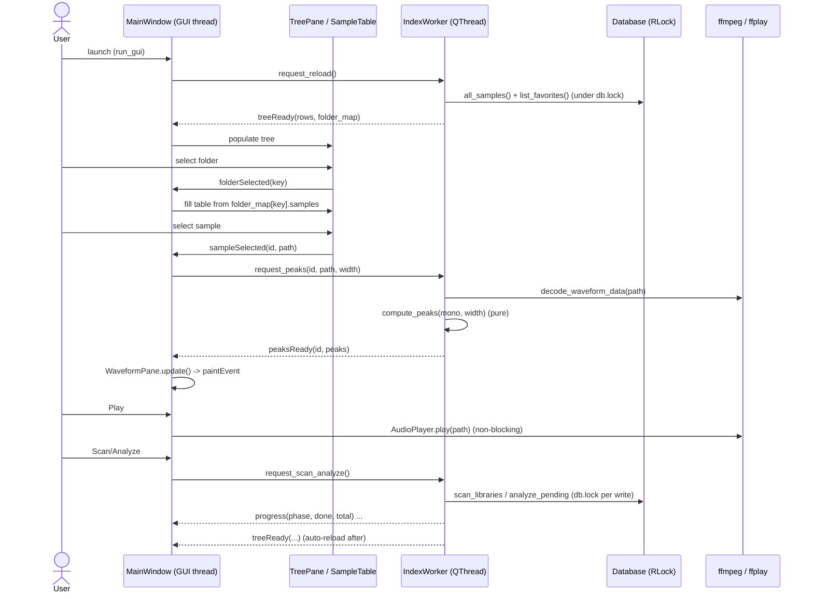

# cratedig — Architecture

A local, TUI-first fork of Sononym: index a sample library, search by descriptors
(BPM / key / mood / tags), find acoustically similar samples, and download new
audio from multiple sources into the same library.

## Layers

```
                 ┌───────────────────────────┐
                 │  tui/  (Textual)           │  presentation only
                 └─────────────┬─────────────┘
                               │ calls
                 ┌─────────────┴─────────────┐
                 │  index.py                 │  orchestration glue
                 │  (scan / analyze / similar)│
                 └───┬─────────┬─────────┬────┘
        ┌────────────┘         │         └────────────┐
   ┌────┴────┐          ┌──────┴──────┐         ┌──────┴──────┐
   │ scan/   │          │ audio/      │         │ search/     │
   │ probe + │          │ analyzer    │         │ query build │
   │ walk fs │          │ features    │         │ (SQL)       │
   └────┬────┘          │ similarity  │         └──────┬──────┘
        │               └──────┬──────┘                │
        └───────────┬──────────┴────────────┬──────────┘
                    │                        │
              ┌─────┴─────┐            ┌─────┴─────┐
              │ db/       │            │ config.py │
              │ sqlite    │            └───────────┘
              └─────┬─────┘
   ┌────────────────┴───────────────┐
   │ sources/ (downloaders)         │   metadata/ (enrichment)
   │ youtube · yandex · freesound   │   musicbrainz · discogs
   │ · archive  + manager(fallback) │
   └────────────────────────────────┘
```

## Data flow (Sononym-style indexing)

1. **Scan** (`scan/scanner.py`): walk `library_dirs`, probe each audio file
   (duration / samplerate / channels via soundfile→mutagen fallback), sha1 hash
   for duplicate detection, upsert a `samples` row. No heavy deps.
2. **Analyze** (`audio/analyzer.py`, optional librosa): compute BPM (beat_track),
   musical key (chroma × Krumhansl-Schmuckler profiles), loudness (RMS→dB), a
   compact waveform preview, and a weighted acoustic feature vector
   (`audio/features.py`). The vector blends log-mel spectrum, MFCCs, spectral
   contrast, chroma, amplitude envelope, duration, crest factor, brightness, and
   noisiness; it is stored as a float32 blob on the sample row.
3. **Search** (`search/query.py`): parameterized SQL over descriptors — BPM range,
   key, scale, mood, tags (all-of), filename text, source.
4. **Similarity** (`audio/similarity.py`): cosine top-k over feature vectors;
   brute-force numpy now, swap to hnswlib (`[index]` extra) at scale behind the
   same `cosine_topk` interface.

## Download (combined fallback for stability)

`sources/manager.py` reads `sources.strategy`:
- `combined` → try backends in `sources.order` until one succeeds.
- `single` → use `sources.default` only.

Each backend implements the `Downloader` ABC (`sources/base.py`) and self-registers
via `@register`. Every attempt is logged to the `downloads` table.

| backend    | uses              | notes |
|------------|-------------------|-------|
| youtube    | yt-dlp + ffmpeg   | also Bandcamp/SoundCloud; `ytsearch1:` for text |
| yandex     | bundled yamdl.exe | confirm CLI flags in `yandex.py._build_args` |
| freesound  | FreeSound APIv2   | token-only → HQ mp3 previews (sampling-grade) |
| archive    | internetarchive   | public items, no key |

Downloaded files land in `download_dir`; re-scanning that folder indexes them with
the proper `source`.

## Metadata enrichment

`metadata/` providers (MusicBrainz, Discogs) implement `MetadataProvider` and write
`metadata` rows keyed `(sample_id, provider)`. Not wired into the TUI yet (next
session).

## Database

SQLite (WAL), schema in `cratedig/db/schema.sql`, applied idempotently on startup.
Tables: `samples`, `tags`, `sample_tags`, `downloads`, `metadata`, `meta`.

## Key decisions

- **Optional librosa.** Core app (scan/browse/search/download) runs with light
  deps; analysis is `pip install 'cratedig[analysis]'`. Imported lazily.
- **Plugin registries** for sources and metadata keep backends decoupled and make
  adding a source a one-file change.
- **No ORM.** Plain dataclasses + parameterized SQL; small surface, full control.

## Not done yet (roadmap)

- Auto-classification (drum/bass/synth/…) → `samples.category`. **DONE** (filename + audio fallback).
- Duplicate-detection UI over `file_hash`.
- In-TUI audio playback / waveform. **DONE** (TUI + GUI).
- Download screen + metadata enrichment wired into TUI. **PARTIAL** (download done; metadata still unwired — see Roadmap v2 §6).
- hnswlib ANN index for large libraries.
- **Roadmap v2 epics (planned, this planning session): see section below.**

---

## GUI skeleton (PySide6)

This section is the authoritative gate for the desktop GUI. It is a **skeleton**:
browse a folder tree, list samples in a table, draw a waveform, and play/stop a
selection, with background scan/analyze. No new feature surface beyond that. It
adds **no production code** by itself — it is the contract the tester and developer
build against.

### Scope fence (what this skeleton is, and is not)

In scope:

- Folder **tree pane** (left) driven by `build_folder_tree`.
- **Sample table** (center) for the selected folder.
- **Waveform pane** (right/bottom) for the selected sample.
- **Play / Stop** of the selected sample.
- **Background scan + analyze** triggered from the GUI, with progress feedback.
- A **display-only** `★ Favorites` branch in the tree (read from `list_favorites`).

Explicitly **out of scope** for the skeleton (do not build, do not stub UI for):

- File management, move/rename/delete, duplicate detection UI.
- Tagging / editing descriptors, mood/category editing.
- Download UI, source selection, metadata enrichment UI.
- Similarity / "find similar" UI (`find_similar` exists but stays unwired).
- Favorites mutation (add/remove) — the branch is read-only display only.
- Search/query UI.

`web/` is removed in a **separate** change; this section does not depend on it and
must not reference it.

### Assumptions

1. **PySide6** (Qt for Python, LGPL) is the GUI toolkit; it is a new optional
   dependency added as a `[gui]` extra, mirroring the existing `[analysis]` pattern.
2. PySide6 and the GUI entry point are **lazily imported** so the core app and the
   TUI still run without Qt installed (same convention as `__main__.py` tui/web).
3. A single shared `Database` instance is created on the GUI (main) thread and
   passed to the worker; concurrent access is serialized through `Database.lock`,
   which is what the existing TUI download worker already relies on
   (`check_same_thread=False`).
4. ffmpeg / ffplay remain a project requirement (already true for scan/analyze and
   the TUI); the GUI reuses them rather than adding a Qt audio dependency.
5. One sample at a time is decoded for the waveform; rapid selection changes cancel
   the in-flight decode by ignoring stale results (sequence guard), not by killing
   the subprocess.

### Package layout — `cratedig/gui/`

| module             | responsibility                                                                 | imports Qt? |
|--------------------|--------------------------------------------------------------------------------|-------------|
| `__init__.py`      | `run_gui(cfg: Config) -> int`: create `QApplication`, `Database`, `MainWindow`, exec. | yes |
| `__main__.py`      | `python -m cratedig.gui` shim → `run_gui(load_config())`.                       | yes |
| `logic.py`         | **Pure** functions only: `compute_peaks`, `tree_rows`. No Qt, no I/O, no DB.    | **no** |
| `worker.py`        | `IndexWorker(QObject/QThread)`: runs all blocking work, emits Qt signals.        | yes |
| `player.py`        | Thin wrapper around `audio.playback.AudioPlayer` (play/stop/is_playing).         | yes (Qt-side caller) |
| `tree_pane.py`     | `TreePane(QTreeWidget)`: renders `tree_rows`, emits folder-selected.             | yes |
| `sample_table.py`  | `SampleTable(QTableView/QTableWidget)`: lists a folder's samples, emits selection. | yes |
| `waveform_pane.py` | `WaveformPane(QWidget)`: `paintEvent` draws min/max peaks from `compute_peaks`.   | yes |
| `main_window.py`   | `MainWindow(QMainWindow)`: left sidebar (`QButtonGroup`: Samples/Ableton) + `QStackedWidget` (index 0 = samples splitter, index 1 = `AlsExplorerPanel`); wires panes ↔ worker ↔ player; owns the layout. | yes |
| `als_explorer.py`  | `AlsExplorerPanel(QWidget)`: embedded ALS Explorer page inside MainWindow (see below). | yes |

Layout rationale: the only files the **tester** targets are `logic.py` (pure,
Qt-free, fully unit-testable) and the documented signal/return shapes. All Qt
widgets stay thin so the testable logic is concentrated in one module — this avoids
needing a Qt event loop in the test suite.

### ALS Explorer component

The ALS Explorer is an **embedded `QWidget` page** inside `MainWindow`, reachable
via a permanent left sidebar navigator. The sidebar uses a `QButtonGroup` (exclusive
toggle) with two buttons — "Samples" and "Ableton" — that switch a `QStackedWidget`:
index 0 is the samples splitter (existing sample browser), index 1 is the
`AlsExplorerPanel`. The old separate toolbar "Ableton" action and `_als_window`
attribute were removed. The toolbar now only holds Duplicates (D).

The panel uses the **native Qt theme**: text color inherits the application palette
(`_colored_label(color="")` means inherit), card fills use translucent `rgba(...)`
overlays that work across light and dark system themes, and semantic indicator colors
(`C_OK`, `C_WARN`, `C_ERR`, `C_VST`, `C_M4L`, `C_SILENT`) are tuned for legibility
in both modes. RU/EN language toggle buttons are native checkable `QPushButton`s.

#### Package layout — `cratedig/als/`

| module        | responsibility |
|---------------|----------------|
| `__init__.py` | package marker |
| `parser.py`   | Pure stdlib parser (gzip + xml.etree). No external deps. Public API: `parse_als(path) -> dict` and `scan_vst_plugins(vst2_names, vst3_names) -> dict` (latter unused by GUI — dead app code). |

`parse_als` returns:
```
{
  "ableton_version": str,
  "tracks": list[dict],        # each track: name, type, devices, instruments, plugins
  "main": dict,                # master/main channel info + fader dB + instruments + plugins
  "arrangement": dict,         # length in bars/seconds
  "samples": {"found": [...], "missing": [...]}
}
```

Every track dict and `main` include two aggregated lists:
- `instruments`: display names of instruments on that channel (native, VST2, VST3, AU, M4L).
- `plugins`: display names of effects/MIDI FX on that channel.

Names are tagged `[VST2]`, `[VST3]`, `[AU]`, or `[M4L]`; native Live devices are plain.

Supports Ableton Live 10/11/12 sets. Recurses instrument racks to depth ≤ 2. Detects
"Collect All & Save" sample presence, computes arrangement length, reads master fader
dB, and lists native devices, VST2/VST3, Audio Units (AU), and Max for Live (M4L) devices.

**Plugin classification:**
- `AuPluginDevice` (macOS Audio Units): classified via `ComponentType` fourcc — `aumu` = instrument, anything else = effect; `NumAudioInputs == 0` as fallback; `struct.error` caught on malformed fourcc.
- `PluginDevice` (VST2/VST3): VST3 classified via `DeviceType` attribute (1 = instrument, 2 = effect); VST2 uses `NumAudioInputs == 0` fallback.

#### `cratedig/gui/als_explorer.py` — Qt panel

`AlsExplorerPanel(QWidget)` provides:
- **Header bar**: "Open .als" file button + RU/EN i18n toggle (module-global `_LANG`;
  `T()` reads it — single-panel-instance contract). Language buttons are native
  checkable `QPushButton`s.
- **Info area + tabs** split by a vertical `QSplitter` (user-draggable): info area
  (top ~50%) holds the MAIN CHANNEL card (fader-dB with color logic), summary
  (arrangement length + 3rd-party device count), and expandable Samples found/missing
  section; tabs (bottom ~50%) are a 3-tab `QTabWidget`.
- **3-tab `QTabWidget`**: Instruments / Plugins / Tracks. Instruments and Plugins are
  built from the parser's aggregated `instruments`/`plugins` keys; Tracks lists all
  tracks by name and type.
- **Drag & drop**: `setAcceptDrops(True)`; accepts `.als` files dragged onto the panel.

#### Dependency note

`cratedig/als/parser.py` uses only the Python standard library (gzip, xml.etree).
No new package dependency is introduced; the panel rides on the existing `[gui]`
PySide6 extra.

### DECISION A — Waveform peak source (CONFIRMED, refined)

`samples.waveform_preview` is a **TEXT** string (Unicode block art for the TUI); it
is not numeric and cannot be drawn in Qt. Peaks are therefore computed on demand by
decoding the file.

**Refinement over the brief:** `audio/playback.py` already exposes
`decode_waveform_data(path, *, bins, sample_rate, channels, max_seconds)
-> WaveformData`, where `WaveformData.peaks` is a `channels × bins × (min, max)`
float32 array built by the pure `_envelope` helper. This is a cleaner reuse than
the raw ffmpeg block at lines ~122–129 / ~268–277, and it already handles the
ffmpeg→soundfile fallback. The GUI worker calls `decode_waveform_data`, and the
**pure** `compute_peaks` reduces that array to the exact shape the widget draws.

No schema change. Decode runs on the worker thread; drawing happens in
`WaveformPane.paintEvent`.

**Pure-function boundary — `gui/logic.py::compute_peaks`:**

```python
def compute_peaks(samples: np.ndarray, width: int) -> list[tuple[float, float]]:
    """Reduce a 1-D mono float32 signal to `width` (min, max) peak pairs.

    Contract (for tests):
      - samples: 1-D np.ndarray (mono). Non-finite values are dropped.
      - width: target column count (== pixel width of the waveform widget).
      - Returns a list of exactly `min(width, len(samples))` (min, max) tuples,
        each a plain Python float, in time order.
      - width <= 0 or empty/all-non-finite input -> returns [].
      - Each pair satisfies min <= max. Values are NOT normalized (raw amplitude);
        the widget scales to its own height.
    """
```

Notes for the tester:

- Deterministic, no I/O — feed synthetic arrays (ramp, sine, silence, single
  sample, NaN/inf mixed) and assert length + bounds.
- The widget passes its current pixel width as `width`, so re-decoding is not
  required on resize only when content changes; resize may re-call `compute_peaks`
  on a cached mono array (the worker may hand back the mono signal alongside, or
  the widget caches the last decoded array — implementation choice for the
  developer, but `compute_peaks` itself stays pure).
- The worker is responsible for producing the **mono** 1-D array (e.g. average the
  channels from `WaveformData` or request `channels=1`); `compute_peaks` assumes
  mono input.

### DECISION B — Playback backend (CONFIRMED)

Reuse `audio.playback.AudioPlayer` (ffplay subprocess) rather than
`QtMultimedia.QMediaPlayer`.

Rationale: ffplay already plays every format the library ingests (mp3/wav/flac via
the same decode path), it is already a project requirement, and it adds zero new Qt
modules or codec licensing concerns. `QMediaPlayer` would pull in the QtMultimedia
module and platform codec backends with no benefit for a skeleton.

`gui/player.py` wraps a single `AudioPlayer` instance and exposes
`play(path)` / `stop()` / `is_playing()`. Play/stop are non-blocking (ffplay is a
detached subprocess), so they may be called directly on the GUI thread. Stop on
window close is mandatory.

### tree_rows pure-function contract — `gui/logic.py::tree_rows`

`build_folder_tree` returns `dict[str, FolderNode]`; Qt's `QTreeWidget` wants an
ordered, parent-first row list. `tree_rows` flattens the dict and prepends a
synthetic, display-only `★ Favorites` branch.

```python
def tree_rows(
    nodes: dict[str, FolderNode],
    favorites: list[Sample],
) -> list[TreeRow]:
    """Flatten a folder-tree dict into parent-before-child rows for QTreeWidget.

    TreeRow = tuple[parent_key, key, label, is_favorites_branch]
      - parent_key: str | None  (None == top-level item)
      - key: str                (folder_key for real folders; synthetic for favs)
      - label: str              (display text; folder name, or sample filename)
      - is_favorites_branch: bool

    Ordering contract (for tests):
      1. The synthetic favorites branch comes FIRST:
           ("__favorites__", None, "★ Favorites", True)   # root
           then one row per favorite sample:
           (key="__favorites__", child key="fav:<sample.id>",
            label=sample.filename, is_favorites_branch=True)
         If `favorites` is empty, the ★ Favorites root is still emitted (no
         children) — OR omit it; pick one and the test asserts it. RECOMMENDED:
         always emit the root so the user sees the empty branch.
      2. Real folder rows follow, sorted by `key`, with every parent guaranteed
         to appear before any of its children (build_folder_tree already includes
         all ancestors, so sorting keys lexically yields parent-first because a
         parent key is a prefix segment of its children).
      3. is_favorites_branch is False for all real folder rows.

    Pure: no Qt, no DB. `favorites` is passed in by the caller (worker reads
    list_favorites under Database.lock).
    """
```

Notes for the tester:

- Favorites rows are **identified** by `is_favorites_branch=True` and a `fav:` /
  `__favorites__` key namespace so the widget can route a favorites-row selection
  to "show that one sample" vs. a folder-row selection to "show folder contents".
- Real folder selection maps `key` back to `nodes[key].samples` for the table; the
  favorites synthetic keys carry the sample id (`fav:<id>`) for direct lookup.
- Test cases: empty nodes + empty favs (just the ★ root), nested folders
  (assert parent precedes child), favorites present (assert they lead).

### Threading contract

The GUI (main/Qt) thread **never** performs blocking work. Everything that touches
the filesystem, the database, or ffmpeg runs on a single `IndexWorker` living on a
`QThread`; results cross back to the GUI thread exclusively via **Qt signals**
(queued connections), which is Qt's thread-safe hand-off.

Blocking operations that MUST run on the worker:

| operation                              | backend call                                  |
|----------------------------------------|-----------------------------------------------|
| load samples for browse                | `Database.all_samples()`                       |
| build folder tree                      | `build_folder_tree(samples, roots)`            |
| read favorites                         | `Database.list_favorites()`                    |
| scan library                           | `index.scan_libraries(db, cfg, progress)`      |
| analyze pending                        | `index.analyze_pending(db, cfg, progress)`     |
| classify pending (optional, same flow) | `index.classify_pending(db, progress)`         |
| decode waveform peaks                  | `playback.decode_waveform_data(path, ...)`     |

Signal sketch (names are the contract; exact PySide6 `Signal(...)` types in code):

```
IndexWorker (lives on QThread)
  ── inbound (GUI -> worker, via queued slot calls / invokeMethod) ──
    request_reload()                         # reload samples + tree + favorites
    request_scan_analyze()                   # scan then analyze (then classify)
    request_peaks(sample_id, path, width)    # decode + reduce to peaks

  ── outbound (worker -> GUI, Signals) ──
    treeReady(rows: list[TreeRow], folder_map)   # tree_rows output (+ key->samples)
    progress(phase: str, done: int, total: int)  # bridges index.py callbacks
    peaksReady(sample_id: int, peaks: list[tuple[float,float]])
    failed(context: str, message: str)           # surface errors to a status bar
```

Concurrency rules (enforced, documented for the reviewer):

- The `Database` connection is created once on the GUI thread with
  `check_same_thread=False`; **all** access from the worker is wrapped in
  `with db.lock:` (an `RLock`). Reads and writes are both serialized through it —
  SQLite writes are not concurrent-safe even with a shared connection, so the lock,
  not the connection, is the serialization point.
- `index.scan_libraries` / `analyze_pending` / `classify_pending` already take
  `db.lock` internally per write; the worker calls them as-is. The worker only
  takes `db.lock` itself for the direct reads it issues (`all_samples`,
  `list_favorites`, `get_sample`).
- The two progress callback **signatures differ** and must be bridged correctly to
  the single `progress` signal:
    - `scan_libraries(progress: Callable[[Path, int], None])` — `(path, count)`.
    - `analyze_pending(progress: Callable[[int, int], None])` — `(done, total)`.
    - `classify_pending(progress: Callable[[int, int], None])` — `(done, total)`.
  Wrap each in a small adapter that emits `progress(phase, done, total)`; do not
  pass a Qt signal as the raw callback (it would emit cross-thread but with the
  wrong arity for scan).
- Waveform decode uses a **sequence guard**: each `request_peaks` carries the
  `sample_id`; the GUI ignores any `peaksReady` whose `sample_id` is not the
  currently selected sample (handles fast arrow-key scrubbing without subprocess
  cancellation).

### Interaction diagram



### Entry point wiring

`__main__.py` gains a `gui` subcommand alongside `tui`/`web`, lazily importing
`cratedig.gui.run_gui` so a missing PySide6 raises a clear "install cratedig[gui]"
message rather than an import error at startup — identical to the existing optional
-dep pattern.

### Trade-offs

- **ffplay over QMediaPlayer**: zero new media stack and uniform format support, at
  the cost of no sample-accurate position callback (acceptable; the skeleton has no
  scrub/seek UI).
- **Decode-on-select over precomputed numeric peaks**: no schema change and no
  re-analysis pass, at the cost of a short decode latency per selection (mitigated
  by the worker + sequence guard; precomputed peak blobs are a future optimization).
- **Single worker thread**: simple and lock-friendly; scan/analyze and a peak
  decode cannot run truly in parallel. Acceptable for a skeleton; a second
  decode-only thread is a later option if scrubbing feels slow.
- **Logic concentrated in `logic.py`**: keeps the test suite Qt-free, at the cost
  of slightly thinner widgets that delegate computation outward.

---

# Roadmap v2 — planned feature epics (2026-06)

Six epics planned in a design-only session. Decisions locked with the user are
flagged **[DECIDED]**. No code was written for these yet; this section is the build
contract. Order below is the recommended implementation order (5 → 2 → 1 → 3 → 6 → 4):
the cheap surgical wins first, the Simpler epic last.

Cross-cutting principle (unchanged from v1): all heavy DSP / DB / FS work stays on
the `IndexWorker` thread; pure, Qt-free computation lives in `gui/logic.py` or new
`audio/*` modules so it stays unit-testable; schema changes are additive and applied
idempotently via `_ensure_*` migrations.

## §5 — Remove duplicated columns/fields (smallest, do first)

Pure UI trim, no schema, no logic risk.

- `gui/sample_table.py`: drop `"Extension"` from `_COLUMNS` and its value in
  `set_samples` (extension already shown as **Format** in the metadata panel).
  Re-derive `_SIM_COL` / `_FNAME_COL` after the edit (index shift).
- `gui/logic.py::format_metadata`: remove the **Duration**, **BPM**, and **Key**
  rows (all three already columns in the table). Keep Format / Sample rate /
  Channels / Size / Mood / embedded tags.
- Tests to update: GUI smoke test asserting `10 table cols` → `9`; any
  `format_metadata` assertion referencing Duration/BPM/Key.

Acceptance: table has 9 columns (no Extension); metadata panel shows no
Duration/BPM/Key line; suite green.

## §2 — Drag & Drop sample file → DAW

Standard OS file-drag: the app hands the DAW a real filesystem path via
`text/uri-list` (Windows CF_HDROP). No copy, no schema.

- `gui/sample_table.py`: enable `setDragEnabled(True)`, override `startDrag` (or
  install a `QDrag`): build `QMimeData` with
  `setUrls([QUrl.fromLocalFile(s.path)])` for the selected row(s),
  `drag.exec(Qt.CopyAction)`.
- Pure helper in `gui/logic.py`: `file_urls(samples) -> list[str]` (returns local
  file paths) — keeps URL list building testable; the widget wraps them in `QUrl`.
- Multi-select rows → multiple URLs (groundwork shared with §3 crate-drag).

Acceptance: drag a row into Explorer/DAW drops the original file; unit test on
`file_urls` ordering + path passthrough.

## §1 — Smarter character auto-tags (DSP heuristics) **[DECIDED: DSP, no ML]**

Character descriptors stored as **tags** (existing `tags` / `sample_tags` tables),
NOT as `category`/`instrument_class`. They appear in the Tags column and are already
searchable (all-of tag filter in `search/query.py`).

New pure module `audio/descriptors.py`:
`derive_character_tags(y_mono, y_stereo, sr, scalars) -> list[str]`, fed the signal
+ the scalar block already computed in `audio/features.py::_scalar_features`
(centroid, bandwidth, rolloff, zcr, flatness, crest, duration, envelope decay).

Heuristic map (thresholds tuned during impl, table is the intent):

| tag      | DSP signal |
|----------|-----------|
| `bright` | high spectral centroid (rolloff95 high) |
| `dark`   | low spectral centroid |
| `boomy`  | strong low-band energy + long envelope sustain |
| `short`  | duration < ~0.4 s OR fast envelope decay |
| `dry`    | low late-tail RMS ratio (energy concentrated early) |
| `reverb` | high late-tail RMS ratio (long decay tail) |
| `dirty`  | high spectral flatness / high crest noisiness |
| `wide`   | low L/R correlation (**needs stereo decode**) |
| `808`    | sustained low fundamental + harmonic + bass band |
| `lofi`   | HF rolloff low + raised noise floor |

**Gotcha — stereo:** `wide` needs L/R correlation but `extract_features` loads
`mono=True`. Add a lightweight second decode (`mono=False`, channels averaged only
for the existing vector) OR compute width in the same analyze pass before mono
collapse. Width is the only stereo-dependent tag; everything else reuses mono.

Genre-ish labels the user listed (`vinyl`, `acoustic`, `jazz`, `soul`) are weak for
pure DSP — keep them **keyword-only** (filename) for now; an optional ML extra is a
deferred phase-2 (explicitly out of scope this round per [DECIDED: DSP only]).

Wiring: new `index.py::tag_pending(db, progress)` (mirrors `classify_pending`)
writes derived tags. **Add `sample_tags.source TEXT DEFAULT 'manual'`** (migration)
so re-running auto-tagging only clears/rewrites `source='auto'` rows and never wipes
user tags. GUI/TUI: trigger alongside analyze; a "Re-tag" action optional.

Acceptance: `derive_character_tags` unit-tested on synthetic signals (bright sine =
`bright`, silence-padded tail = `reverb`, etc.); auto tags never overwrite manual.

## §3 — Crates (playlists) **[DECIDED]**

User-curated ordered collections of samples; draggable as a whole into a DAW.

Schema (additive, `_ensure` migration):

```sql
CREATE TABLE IF NOT EXISTS crates (
    id INTEGER PRIMARY KEY,
    name TEXT NOT NULL UNIQUE,
    created_at TEXT NOT NULL
);
CREATE TABLE IF NOT EXISTS crate_samples (
    crate_id  INTEGER NOT NULL REFERENCES crates(id) ON DELETE CASCADE,
    sample_id INTEGER NOT NULL REFERENCES samples(id) ON DELETE CASCADE,
    position  INTEGER NOT NULL,
    added_at  TEXT NOT NULL,
    PRIMARY KEY (crate_id, sample_id)
);
```

`db/database.py` methods: `create_crate(name)`, `rename_crate`, `delete_crate`,
`add_to_crate(crate_id, sample_id)`, `remove_from_crate`, `list_crates()`,
`crate_samples(crate_id) -> list[Sample]` (ordered by `position`). All under
`db.lock`.

GUI:
- `gui/logic.py::tree_rows` gains a synthetic **`📦 Crates`** branch (same pattern as
  `★ Favorites`): one child row per crate, key namespace `crate:<id>`. Worker reads
  crates under lock and passes them into `tree_rows` like favorites.
- Selecting a crate row fills the table from `crate_samples(id)`.
- `gui/sample_table.py` context menu: **"Add to crate ▸"** submenu listing crates +
  **"New crate…"**.
- Crate **whole-drag**: dragging a `crate:<id>` tree node builds `QMimeData` with
  URLs of *all* member samples (reuses `file_urls` from §2). Tree node drag override
  in `gui/tree_pane.py`; worker supplies member paths.

Acceptance: create crate, add via context menu, crate appears in tree, drag crate
drops all member files into DAW; DB methods unit-tested.

## §6 — Tracks search fix + MB/Discogs local cache **[DECIDED: incremental cache; root cause = unwired metadata]**

**Root cause** (confirmed in code): `sources/manager.py::search` for `mode="tracks"`
iterates `TRACK_FALLBACK = ["yandex", "youtube"]` and **returns on the first backend
that yields hits** — Yandex almost always does, so YouTube and the metadata
providers are never consulted. `metadata/musicbrainz.py` + `discogs.py` exist but are
not wired anywhere.

Target behavior: in `tracks` mode, gather candidates from *all* audio backends, then
cross-check each against canonical MusicBrainz + Discogs metadata to pick the most
authoritative result (defeat re-uploads by preferring the earliest official release /
matching duration), querying a **local incremental cache** instead of hitting the
APIs on every search.

Phased:

- **6a — gather, don't stop:** `search("tracks")` collects hits from yandex AND
  youtube (no early return); returns the merged list. Fixes the "only Yandex" bug
  immediately, no metadata dependency.
- **6b — wire MB/Discogs + rank:** for each candidate, look up `(artist, title)` in
  MusicBrainz + Discogs; score by metadata match (title/artist/duration agreement,
  earliest release year as authority signal); sort hits by score so the
  most-authoritative source ranks first. Enrich `SearchHit` with the matched
  metadata for display.
- **6c — local incremental cache + launch refresh** **[DECIDED: incremental, not
  full dump]**:

  ```sql
  CREATE TABLE IF NOT EXISTS metadata_cache (
      id INTEGER PRIMARY KEY,
      provider   TEXT NOT NULL,          -- musicbrainz | discogs
      query_norm TEXT NOT NULL,          -- lowercased "artist|title"
      response_json TEXT NOT NULL,
      fetched_at TEXT NOT NULL,
      UNIQUE(provider, query_norm)
  );
  ```

  Lookup order: local `metadata_cache` first → on miss/stale call the API and store.
  On app launch, refresh entries older than `metadata.cache_ttl_days` (config,
  default e.g. 30) in the background — NOT a full DB dump (tens of GB, rejected).
  This is "sync on launch" reinterpreted as **stale-cache refresh**, which is what
  keeps it fast and small per the user's directive.

Config additions: `[metadata] cache_ttl_days`, `musicbrainz.user_agent`,
`discogs.token` (Discogs needs a token; MB needs a UA string).

Acceptance: `tracks` search returns hits from both backends ranked by metadata
authority; repeated identical search hits the cache (no second API call); cache TTL
refresh unit-tested with a frozen clock.

## §4 — Simpler clone (sample editor) **[DECIDED: full scope at once]**

A combined **preview + editor** that *replaces* the current waveform/preview zone.
Largest epic. New widget `gui/simpler_pane.py` swaps in where `WaveformPane` sits in
`main_window.py`; it plays the selected sample (preview role) and edits it.

Editor surface (full set, per [DECIDED]):

- Waveform display (reuse `playback.decode_waveform_data` + `logic.compute_peaks`).
- **Region** selection: draggable start/end handles; only the region is
  played/exported.
- **Fade** in / out: draggable fade handles over the region edges.
- **Gain**: louder/quieter slider applied to the render.
- **ADSR** envelope (Attack/Decay/Sustain/Release) applied over the region.
- **Reverse**.

Pure DSP core — new Qt-free `audio/editor.py`:
`render_edit(path, region, *, reverse, gain_db, fade_in, fade_out, adsr) ->
np.ndarray` and `write_wav(buffer, sr, dest) -> Path`. numpy + soundfile only, fully
unit-testable (no Qt, no ffmpeg). Keeps all signal math out of the widget.

**Preview playback of edits:** `AudioPlayer` is ffplay and cannot play a numpy
buffer, so the edited region is rendered to a temp WAV and ffplay plays that.
(Original-file playback path unchanged; edits go through render-then-play.)

**Export paths** (both required):
1. Explicit **Export → Saved**: render → write WAV into the **Saved** folder.
2. **Drag from the Simpler waveform → DAW**: on drag-start, synchronously render the
   current edit to a WAV in Saved, then `QDrag` its `QUrl` (reuses §2 `file_urls`).
   So a drag both *persists* the edit to Saved and drops it into the DAW.

**Saved folder** = new `paths.saved_dir` config (default e.g. `<library>/_saved`).
It is a normal scanned root so exports auto-index into `samples` (give them
`source='edit'`), and it appears as a pinned **`💾 Saved`** branch in the tree
(synthetic branch like Favorites/Crates, or simply a recognized root). Worker
auto-indexes the exported file after render.

Threading: render runs on the `IndexWorker` (`request_render(params)` →
`renderReady(path)` signal) for the explicit export; the drag-export renders
synchronously on drag-start (samples are short — acceptable; can move to worker if
latency bites).

New/changed files: `gui/simpler_pane.py` (new), `audio/editor.py` (new),
`gui/worker.py` (render slot/signal + auto-index of Saved), `gui/main_window.py`
(swap preview zone for Simpler), `config.py` + `config.example.toml`
(`paths.saved_dir`), `gui/logic.py` (Saved branch in `tree_rows`; ADSR/fade curve
math can live here as pure helpers).

Acceptance: load sample into Simpler; set region + reverse + gain + fade + ADSR;
preview plays the edit; Export writes to Saved and it appears in the Saved branch;
drag from the Simpler waveform drops a rendered WAV into the DAW and persists it to
Saved. `audio/editor.py` unit-tested (reverse, gain, fade ramps, ADSR shape,
region bounds) on synthetic buffers.

## Schema delta summary (all additive, `_ensure_*` idempotent)

| change | epic |
|--------|------|
| `sample_tags.source TEXT DEFAULT 'manual'` | §1 |
| `crates`, `crate_samples` tables | §3 |
| `metadata_cache` table | §6 |
| `paths.saved_dir` config + `source='edit'` rows | §4 |

No destructive migrations; existing rows unaffected.
