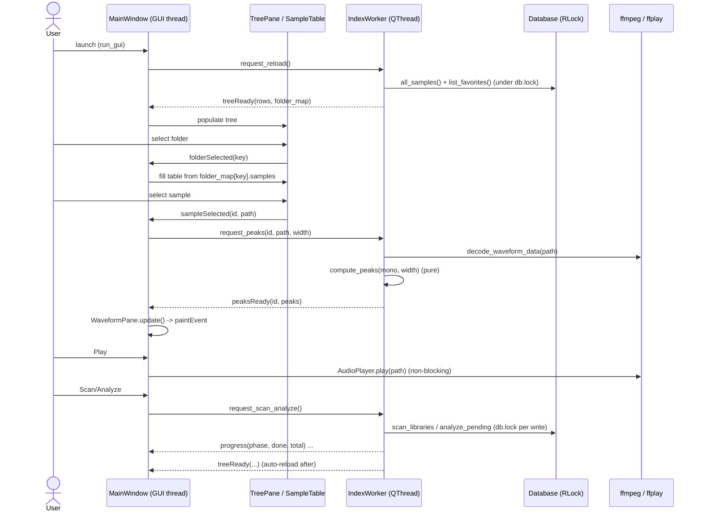

# cratedig — Architecture

A local, TUI-first fork of Sononym: index a sample library, search by descriptors
(BPM / key / mood / tags), find acoustically similar samples, and download new
audio from multiple sources into the same library.

## Layers

```
                 ┌───────────────────────────┐
                 │  tui/  (Textual)           │  presentation only
                 └─────────────┬─────────────┘
                               │ calls
                 ┌─────────────┴─────────────┐
                 │  index.py                 │  orchestration glue
                 │  (scan / analyze / similar)│
                 └───┬─────────┬─────────┬────┘
        ┌────────────┘         │         └────────────┐
   ┌────┴────┐          ┌──────┴──────┐         ┌──────┴──────┐
   │ scan/   │          │ audio/      │         │ search/     │
   │ probe + │          │ analyzer    │         │ query build │
   │ walk fs │          │ features    │         │ (SQL)       │
   └────┬────┘          │ similarity  │         └──────┬──────┘
        │               └──────┬──────┘                │
        └───────────┬──────────┴────────────┬──────────┘
                    │                        │
              ┌─────┴─────┐            ┌─────┴─────┐
              │ db/       │            │ config.py │
              │ sqlite    │            └───────────┘
              └─────┬─────┘
   ┌────────────────┴───────────────┐
   │ sources/ (downloaders)         │   metadata/ (enrichment)
   │ youtube · yandex · freesound   │   musicbrainz · discogs
   │ · archive  + manager(fallback) │
   └────────────────────────────────┘
```

## Data flow (Sononym-style indexing)

1. **Scan** (`scan/scanner.py`): walk `library_dirs`, probe each audio file
   (duration / samplerate / channels via soundfile→mutagen fallback), sha1 hash
   for duplicate detection, upsert a `samples` row. No heavy deps.
2. **Analyze** (`audio/analyzer.py`, optional librosa): compute BPM (beat_track),
   musical key (chroma × Krumhansl-Schmuckler profiles), loudness (RMS→dB), a
   compact waveform preview, and a weighted acoustic feature vector
   (`audio/features.py`). The vector blends log-mel spectrum, MFCCs, spectral
   contrast, chroma, amplitude envelope, duration, crest factor, brightness, and
   noisiness; it is stored as a float32 blob on the sample row.
3. **Search** (`search/query.py`): parameterized SQL over descriptors — BPM range,
   key, scale, mood, tags (all-of), filename text, source.
4. **Similarity** (`audio/similarity.py`): cosine top-k over feature vectors;
   brute-force numpy now, swap to hnswlib (`[index]` extra) at scale behind the
   same `cosine_topk` interface.

## Download (combined fallback for stability)

`sources/manager.py` reads `sources.strategy`:
- `combined` → try backends in `sources.order` until one succeeds.
- `single` → use `sources.default` only.

Each backend implements the `Downloader` ABC (`sources/base.py`) and self-registers
via `@register`. Every attempt is logged to the `downloads` table.

| backend    | uses              | notes |
|------------|-------------------|-------|
| youtube    | yt-dlp + ffmpeg   | also Bandcamp/SoundCloud; `ytsearch1:` for text |
| yandex     | bundled yamdl.exe | confirm CLI flags in `yandex.py._build_args` |
| freesound  | FreeSound APIv2   | token-only → HQ mp3 previews (sampling-grade) |
| archive    | internetarchive   | public items, no key |

Downloaded files land in `download_dir`; re-scanning that folder indexes them with
the proper `source`.

## Metadata enrichment

`metadata/` providers (MusicBrainz, Discogs) implement `MetadataProvider` and write
`metadata` rows keyed `(sample_id, provider)`. Not wired into the TUI yet (next
session).

## Database

SQLite (WAL), schema in `cratedig/db/schema.sql`, applied idempotently on startup.
Tables: `samples`, `tags`, `sample_tags`, `downloads`, `metadata`, `meta`.

## Key decisions

- **Optional librosa.** Core app (scan/browse/search/download) runs with light
  deps; analysis is `pip install 'cratedig[analysis]'`. Imported lazily.
- **Plugin registries** for sources and metadata keep backends decoupled and make
  adding a source a one-file change.
- **No ORM.** Plain dataclasses + parameterized SQL; small surface, full control.

## Not done yet (roadmap)

- Auto-classification (drum/bass/synth/…) → `samples.category`.
- Duplicate-detection UI over `file_hash`.
- In-TUI audio playback / waveform.
- Download screen + metadata enrichment wired into TUI.
- hnswlib ANN index for large libraries.

---

## GUI skeleton (PySide6)

This section is the authoritative gate for the desktop GUI. It is a **skeleton**:
browse a folder tree, list samples in a table, draw a waveform, and play/stop a
selection, with background scan/analyze. No new feature surface beyond that. It
adds **no production code** by itself — it is the contract the tester and developer
build against.

### Scope fence (what this skeleton is, and is not)

In scope:

- Folder **tree pane** (left) driven by `build_folder_tree`.
- **Sample table** (center) for the selected folder.
- **Waveform pane** (right/bottom) for the selected sample.
- **Play / Stop** of the selected sample.
- **Background scan + analyze** triggered from the GUI, with progress feedback.
- A **display-only** `★ Favorites` branch in the tree (read from `list_favorites`).

Explicitly **out of scope** for the skeleton (do not build, do not stub UI for):

- File management, move/rename/delete, duplicate detection UI.
- Tagging / editing descriptors, mood/category editing.
- Download UI, source selection, metadata enrichment UI.
- Similarity / "find similar" UI (`find_similar` exists but stays unwired).
- Favorites mutation (add/remove) — the branch is read-only display only.
- Search/query UI.

`web/` is removed in a **separate** change; this section does not depend on it and
must not reference it.

### Assumptions

1. **PySide6** (Qt for Python, LGPL) is the GUI toolkit; it is a new optional
   dependency added as a `[gui]` extra, mirroring the existing `[analysis]` pattern.
2. PySide6 and the GUI entry point are **lazily imported** so the core app and the
   TUI still run without Qt installed (same convention as `__main__.py` tui/web).
3. A single shared `Database` instance is created on the GUI (main) thread and
   passed to the worker; concurrent access is serialized through `Database.lock`,
   which is what the existing TUI download worker already relies on
   (`check_same_thread=False`).
4. ffmpeg / ffplay remain a project requirement (already true for scan/analyze and
   the TUI); the GUI reuses them rather than adding a Qt audio dependency.
5. One sample at a time is decoded for the waveform; rapid selection changes cancel
   the in-flight decode by ignoring stale results (sequence guard), not by killing
   the subprocess.

### Package layout — `cratedig/gui/`

| module             | responsibility                                                                 | imports Qt? |
|--------------------|--------------------------------------------------------------------------------|-------------|
| `__init__.py`      | `run_gui(cfg: Config) -> int`: create `QApplication`, `Database`, `MainWindow`, exec. | yes |
| `__main__.py`      | `python -m cratedig.gui` shim → `run_gui(load_config())`.                       | yes |
| `logic.py`         | **Pure** functions only: `compute_peaks`, `tree_rows`. No Qt, no I/O, no DB.    | **no** |
| `worker.py`        | `IndexWorker(QObject/QThread)`: runs all blocking work, emits Qt signals.        | yes |
| `player.py`        | Thin wrapper around `audio.playback.AudioPlayer` (play/stop/is_playing).         | yes (Qt-side caller) |
| `tree_pane.py`     | `TreePane(QTreeWidget)`: renders `tree_rows`, emits folder-selected.             | yes |
| `sample_table.py`  | `SampleTable(QTableView/QTableWidget)`: lists a folder's samples, emits selection. | yes |
| `waveform_pane.py` | `WaveformPane(QWidget)`: `paintEvent` draws min/max peaks from `compute_peaks`.   | yes |
| `main_window.py`   | `MainWindow(QMainWindow)`: wires panes ↔ worker ↔ player; owns the layout.       | yes |

Layout rationale: the only files the **tester** targets are `logic.py` (pure,
Qt-free, fully unit-testable) and the documented signal/return shapes. All Qt
widgets stay thin so the testable logic is concentrated in one module — this avoids
needing a Qt event loop in the test suite.

### DECISION A — Waveform peak source (CONFIRMED, refined)

`samples.waveform_preview` is a **TEXT** string (Unicode block art for the TUI); it
is not numeric and cannot be drawn in Qt. Peaks are therefore computed on demand by
decoding the file.

**Refinement over the brief:** `audio/playback.py` already exposes
`decode_waveform_data(path, *, bins, sample_rate, channels, max_seconds)
-> WaveformData`, where `WaveformData.peaks` is a `channels × bins × (min, max)`
float32 array built by the pure `_envelope` helper. This is a cleaner reuse than
the raw ffmpeg block at lines ~122–129 / ~268–277, and it already handles the
ffmpeg→soundfile fallback. The GUI worker calls `decode_waveform_data`, and the
**pure** `compute_peaks` reduces that array to the exact shape the widget draws.

No schema change. Decode runs on the worker thread; drawing happens in
`WaveformPane.paintEvent`.

**Pure-function boundary — `gui/logic.py::compute_peaks`:**

```python
def compute_peaks(samples: np.ndarray, width: int) -> list[tuple[float, float]]:
    """Reduce a 1-D mono float32 signal to `width` (min, max) peak pairs.

    Contract (for tests):
      - samples: 1-D np.ndarray (mono). Non-finite values are dropped.
      - width: target column count (== pixel width of the waveform widget).
      - Returns a list of exactly `min(width, len(samples))` (min, max) tuples,
        each a plain Python float, in time order.
      - width <= 0 or empty/all-non-finite input -> returns [].
      - Each pair satisfies min <= max. Values are NOT normalized (raw amplitude);
        the widget scales to its own height.
    """
```

Notes for the tester:

- Deterministic, no I/O — feed synthetic arrays (ramp, sine, silence, single
  sample, NaN/inf mixed) and assert length + bounds.
- The widget passes its current pixel width as `width`, so re-decoding is not
  required on resize only when content changes; resize may re-call `compute_peaks`
  on a cached mono array (the worker may hand back the mono signal alongside, or
  the widget caches the last decoded array — implementation choice for the
  developer, but `compute_peaks` itself stays pure).
- The worker is responsible for producing the **mono** 1-D array (e.g. average the
  channels from `WaveformData` or request `channels=1`); `compute_peaks` assumes
  mono input.

### DECISION B — Playback backend (CONFIRMED)

Reuse `audio.playback.AudioPlayer` (ffplay subprocess) rather than
`QtMultimedia.QMediaPlayer`.

Rationale: ffplay already plays every format the library ingests (mp3/wav/flac via
the same decode path), it is already a project requirement, and it adds zero new Qt
modules or codec licensing concerns. `QMediaPlayer` would pull in the QtMultimedia
module and platform codec backends with no benefit for a skeleton.

`gui/player.py` wraps a single `AudioPlayer` instance and exposes
`play(path)` / `stop()` / `is_playing()`. Play/stop are non-blocking (ffplay is a
detached subprocess), so they may be called directly on the GUI thread. Stop on
window close is mandatory.

### tree_rows pure-function contract — `gui/logic.py::tree_rows`

`build_folder_tree` returns `dict[str, FolderNode]`; Qt's `QTreeWidget` wants an
ordered, parent-first row list. `tree_rows` flattens the dict and prepends a
synthetic, display-only `★ Favorites` branch.

```python
def tree_rows(
    nodes: dict[str, FolderNode],
    favorites: list[Sample],
) -> list[TreeRow]:
    """Flatten a folder-tree dict into parent-before-child rows for QTreeWidget.

    TreeRow = tuple[parent_key, key, label, is_favorites_branch]
      - parent_key: str | None  (None == top-level item)
      - key: str                (folder_key for real folders; synthetic for favs)
      - label: str              (display text; folder name, or sample filename)
      - is_favorites_branch: bool

    Ordering contract (for tests):
      1. The synthetic favorites branch comes FIRST:
           ("__favorites__", None, "★ Favorites", True)   # root
           then one row per favorite sample:
           (key="__favorites__", child key="fav:<sample.id>",
            label=sample.filename, is_favorites_branch=True)
         If `favorites` is empty, the ★ Favorites root is still emitted (no
         children) — OR omit it; pick one and the test asserts it. RECOMMENDED:
         always emit the root so the user sees the empty branch.
      2. Real folder rows follow, sorted by `key`, with every parent guaranteed
         to appear before any of its children (build_folder_tree already includes
         all ancestors, so sorting keys lexically yields parent-first because a
         parent key is a prefix segment of its children).
      3. is_favorites_branch is False for all real folder rows.

    Pure: no Qt, no DB. `favorites` is passed in by the caller (worker reads
    list_favorites under Database.lock).
    """
```

Notes for the tester:

- Favorites rows are **identified** by `is_favorites_branch=True` and a `fav:` /
  `__favorites__` key namespace so the widget can route a favorites-row selection
  to "show that one sample" vs. a folder-row selection to "show folder contents".
- Real folder selection maps `key` back to `nodes[key].samples` for the table; the
  favorites synthetic keys carry the sample id (`fav:<id>`) for direct lookup.
- Test cases: empty nodes + empty favs (just the ★ root), nested folders
  (assert parent precedes child), favorites present (assert they lead).

### Threading contract

The GUI (main/Qt) thread **never** performs blocking work. Everything that touches
the filesystem, the database, or ffmpeg runs on a single `IndexWorker` living on a
`QThread`; results cross back to the GUI thread exclusively via **Qt signals**
(queued connections), which is Qt's thread-safe hand-off.

Blocking operations that MUST run on the worker:

| operation                              | backend call                                  |
|----------------------------------------|-----------------------------------------------|
| load samples for browse                | `Database.all_samples()`                       |
| build folder tree                      | `build_folder_tree(samples, roots)`            |
| read favorites                         | `Database.list_favorites()`                    |
| scan library                           | `index.scan_libraries(db, cfg, progress)`      |
| analyze pending                        | `index.analyze_pending(db, cfg, progress)`     |
| classify pending (optional, same flow) | `index.classify_pending(db, progress)`         |
| decode waveform peaks                  | `playback.decode_waveform_data(path, ...)`     |

Signal sketch (names are the contract; exact PySide6 `Signal(...)` types in code):

```
IndexWorker (lives on QThread)
  ── inbound (GUI -> worker, via queued slot calls / invokeMethod) ──
    request_reload()                         # reload samples + tree + favorites
    request_scan_analyze()                   # scan then analyze (then classify)
    request_peaks(sample_id, path, width)    # decode + reduce to peaks

  ── outbound (worker -> GUI, Signals) ──
    treeReady(rows: list[TreeRow], folder_map)   # tree_rows output (+ key->samples)
    progress(phase: str, done: int, total: int)  # bridges index.py callbacks
    peaksReady(sample_id: int, peaks: list[tuple[float,float]])
    failed(context: str, message: str)           # surface errors to a status bar
```

Concurrency rules (enforced, documented for the reviewer):

- The `Database` connection is created once on the GUI thread with
  `check_same_thread=False`; **all** access from the worker is wrapped in
  `with db.lock:` (an `RLock`). Reads and writes are both serialized through it —
  SQLite writes are not concurrent-safe even with a shared connection, so the lock,
  not the connection, is the serialization point.
- `index.scan_libraries` / `analyze_pending` / `classify_pending` already take
  `db.lock` internally per write; the worker calls them as-is. The worker only
  takes `db.lock` itself for the direct reads it issues (`all_samples`,
  `list_favorites`, `get_sample`).
- The two progress callback **signatures differ** and must be bridged correctly to
  the single `progress` signal:
    - `scan_libraries(progress: Callable[[Path, int], None])` — `(path, count)`.
    - `analyze_pending(progress: Callable[[int, int], None])` — `(done, total)`.
    - `classify_pending(progress: Callable[[int, int], None])` — `(done, total)`.
  Wrap each in a small adapter that emits `progress(phase, done, total)`; do not
  pass a Qt signal as the raw callback (it would emit cross-thread but with the
  wrong arity for scan).
- Waveform decode uses a **sequence guard**: each `request_peaks` carries the
  `sample_id`; the GUI ignores any `peaksReady` whose `sample_id` is not the
  currently selected sample (handles fast arrow-key scrubbing without subprocess
  cancellation).

### Interaction diagram



### Entry point wiring

`__main__.py` gains a `gui` subcommand alongside `tui`/`web`, lazily importing
`cratedig.gui.run_gui` so a missing PySide6 raises a clear "install cratedig[gui]"
message rather than an import error at startup — identical to the existing optional
-dep pattern.

### Trade-offs

- **ffplay over QMediaPlayer**: zero new media stack and uniform format support, at
  the cost of no sample-accurate position callback (acceptable; the skeleton has no
  scrub/seek UI).
- **Decode-on-select over precomputed numeric peaks**: no schema change and no
  re-analysis pass, at the cost of a short decode latency per selection (mitigated
  by the worker + sequence guard; precomputed peak blobs are a future optimization).
- **Single worker thread**: simple and lock-friendly; scan/analyze and a peak
  decode cannot run truly in parallel. Acceptable for a skeleton; a second
  decode-only thread is a later option if scrubbing feels slow.
- **Logic concentrated in `logic.py`**: keeps the test suite Qt-free, at the cost
  of slightly thinner widgets that delegate computation outward.
