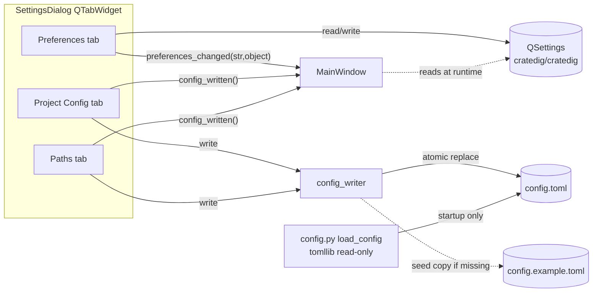
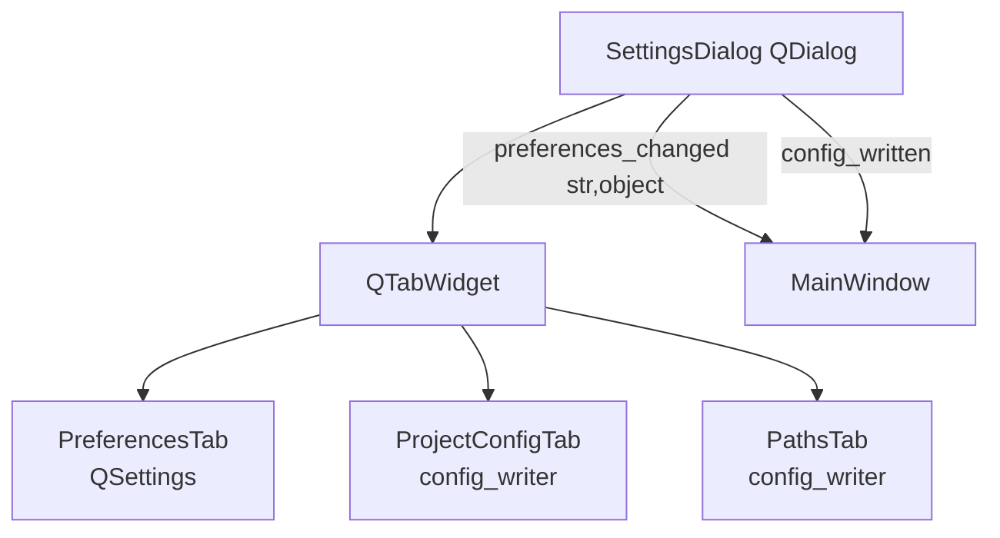

# Settings & Config-Writer Design

Authoritative blueprint for two new pieces in the `cratedig` PySide6 app:

1. `cratedig/config_writer.py` — a comment-preserving TOML writer (tomlkit).
2. A 3-tab `SettingsDialog` (Preferences / Project Config / Paths).

This document is implementation-ready. A tester writes the suite against the
signatures and invariants here; a developer implements against them. **No
production source code is written by this document.**

---

## 1. Overview

Today configuration is split across two stores:

- **`config.toml`** — read-only at runtime via `cratedig/config.py` (`load_config`,
  stdlib `tomllib`). Holds paths, audio extensions, metadata tuning, and source
  tokens. The example file ships with extensive how-to comment blocks
  (freesound / yandex / discogs) that **must survive** any programmatic edit.
- **`QSettings("cratedig","cratedig")`** — per-user UI preferences. Already used
  in `main_window.py` for `playback/auto_preview_on_select`.

The new work keeps that split intact and formalises it:

- **Project Config + Paths** tabs write `config.toml` through `config_writer`.
  Because `Config` is `@dataclass(frozen=True)` and the running worker captured
  its `Config` at startup, **config edits do not live-reload** — the dialog
  writes the file and shows a "restart required" prompt.
- **Preferences** tab reads/writes `QSettings` only. Most preferences apply live
  (no restart); a few are read once at startup (documented per-key below).



### Assumptions

1. tomlkit is added as a **runtime** dependency (not dev-only) — the writer runs
   in the shipped app. Add to `pyproject.toml` / `requirements.txt`.
2. `config.example.toml` is always present in the project root (resolved relative
   to the example shipped alongside the package / repo root). If it is missing
   when a seed is required, the writer raises `ConfigWriterError` rather than
   inventing defaults — the example file is the single source of seed truth.
3. The dialog is non-modal and singleton (matches current `_on_settings`).
4. No migration of pre-existing QSettings values is required beyond the one
   already-shipped key `playback/auto_preview_on_select` (see migration note).
5. "Backend status ✅/❌" is a **static presence check** only: a token is
   considered configured iff `token` is a non-empty string after strip, OR a
   `token_file` is set and that file exists and is non-empty. No network call,
   no token value ever displayed.

---

## 2. Piece 1 — `cratedig/config_writer.py`

### 2.1 Responsibilities

- Resolve the same target path as `load_config`: explicit arg → `CRATEDIG_CONFIG`
  env → `./config.toml`.
- If the target does not exist, **seed** by copying `config.example.toml`
  verbatim (preserving its comments), then apply edits to the seeded document.
- Load the file as a tomlkit document, mutate specific keys **in place** so
  surrounding comments / whitespace / key order are preserved, and write back
  **atomically** (temp file in the same directory + `os.replace`, no leftover
  `.tmp`).
- Be pure file I/O: no coupling to the running worker, no `Config` rebuild, no
  signals. The caller is responsible for the "restart required" UX.

### 2.2 Module-level constants

```python
DEFAULT_CONFIG_NAME = "config.toml"        # mirror config.py
EXAMPLE_CONFIG_NAME = "config.example.toml" # seed source
ENV_CONFIG = "CRATEDIG_CONFIG"             # mirror config.py
```

`config_writer` should import `ENV_CONFIG` / `DEFAULT_CONFIG_NAME` from
`cratedig.config` rather than redefining, to keep path resolution identical.

### 2.3 Errors

```python
class ConfigWriterError(RuntimeError):
    """Raised on unrecoverable writer failures (missing example seed,
    unwritable target dir, malformed existing TOML)."""
```

### 2.4 Path resolution & seeding

```python
def resolve_config_path(path: str | os.PathLike | None = None) -> Path:
    """Target config.toml path: explicit arg → CRATEDIG_CONFIG env → ./config.toml.
    Resolution is identical to config.load_config so reader and writer agree."""

def _example_path(target: Path) -> Path:
    """Locate config.example.toml next to the target's project root.
    Search order: target.parent / EXAMPLE_CONFIG_NAME, then the packaged repo
    root. Raise ConfigWriterError if not found."""

def ensure_config_exists(path: str | os.PathLike | None = None) -> Path:
    """If the resolved target is missing, copy config.example.toml → target
    (shutil.copyfile, comments preserved as raw bytes). Return the target path.
    Raise ConfigWriterError if the example seed cannot be found."""
```

### 2.5 Load / write the tomlkit document

```python
from tomlkit import TOMLDocument

def load_document(path: str | os.PathLike | None = None) -> TOMLDocument:
    """Seed if missing (ensure_config_exists), then parse the target with
    tomlkit.parse and return the round-trippable document. The returned doc
    retains all comments, blank lines, and key ordering."""

def write_document(doc: TOMLDocument,
                   path: str | os.PathLike | None = None) -> Path:
    """Serialize doc with tomlkit.dumps and write atomically:
      1. write to a NamedTemporaryFile in target.parent (same filesystem),
      2. flush + os.fsync,
      3. os.replace(tmp, target).
    On any error, unlink the temp file so no .tmp leftover remains.
    Return the written target path."""
```

### 2.6 Typed mutators (operate on a loaded `TOMLDocument`)

All mutators take the doc, mutate in place (creating tables/keys only when
absent, never reordering existing keys), and return `None`. They never write to
disk — the caller batches edits then calls `write_document` once.

**Paths** (`[paths]`). Values stored as the raw string the user entered
(relative or absolute); the reader resolves them against `root`.

```python
def set_db_path(doc, value: str) -> None: ...
def set_download_dir(doc, value: str) -> None: ...
def set_saved_dir(doc, value: str) -> None: ...
def set_library_dirs(doc, dirs: Sequence[str]) -> None:
    """Replace [paths].library_dirs with a tomlkit array. Preserve multiline
    array style if the existing value was multiline; otherwise inline."""
```

**Audio** (`[audio]`).

```python
def set_audio_extensions(doc, extensions: Sequence[str]) -> None:
    """Replace [audio].extensions. Normalise to lowercase, ensure each starts
    with '.', dedupe preserving order."""
```

**Metadata** (`[metadata]`). **Confirmed key names** from
`config.example.toml` (lines 63-73) — the task's tentative names differ:

| Tentative (task)   | Actual key in TOML               |
|--------------------|----------------------------------|
| cache_ttl_days     | `cache_ttl_days`                 |
| enable_ranking     | `enable_search_ranking`          |
| allow_live_lookup  | `search_live_lookup`             |
| max_live_hits      | `search_max_live_lookup_hits`    |
| (also present)     | `search_live_lookup_min_words`   |
| (also present)     | `discogs_token`, `musicbrainz_useragent` |

```python
def set_metadata_cache_ttl_days(doc, days: int) -> None: ...
def set_metadata_enable_search_ranking(doc, enabled: bool) -> None: ...
def set_metadata_search_live_lookup(doc, enabled: bool) -> None: ...
def set_metadata_search_max_live_lookup_hits(doc, n: int) -> None: ...
def set_metadata_search_live_lookup_min_words(doc, n: int) -> None: ...  # optional, exposed later
def set_discogs_token(doc, token: str) -> None:
    """Sets [metadata].discogs_token. Treated as a 'source token' for the
    backend-status panel even though it lives under [metadata]."""
```

**Sources** (`[sources.<name>]`). Tokens for freesound / yandex; yandex also has
`token_file`.

```python
def set_source_token(doc, name: str, token: str) -> None:
    """Set [sources.<name>].token. Create the sub-table only if absent.
    Never deletes the surrounding how-to comments."""

def set_source_token_file(doc, name: str, token_file: str) -> None:
    """Set [sources.<name>].token_file (yandex). Empty string clears the key
    value but keeps the key (so the example comment context survives)."""
```

### 2.7 Read-only status helpers (for the dialog, no network)

```python
@dataclass(frozen=True)
class TokenStatus:
    name: str
    configured: bool   # True if token non-empty OR token_file exists & non-empty
    via_file: bool     # True if satisfied by token_file rather than inline token

def source_token_status(doc, name: str, root: Path) -> TokenStatus:
    """Static presence check only. token_file is resolved against root the same
    way load_config resolves paths. Never returns or logs the token value."""
```

### 2.8 Round-trip invariant (test contract)

> **Invariant R1:** For any valid `config.toml`,
> `write_document(load_document(p), p)` produces a file **byte-for-byte
> semantically equal** — every comment, blank line, key order, and array style
> is preserved. The only permissible diff is tomlkit's deterministic
> normalisation of whitespace it already controls (none for round-trip with no
> mutation).

> **Invariant R2:** After seeding from `config.example.toml` and applying zero
> mutations, the written `config.toml` is identical to `config.example.toml`
> (the seed copy is verbatim; `load_document` of a freshly seeded file does not
> rewrite it unless `write_document` is called).

> **Invariant R3:** Mutating one key (e.g. `set_source_token(doc,"freesound",x)`)
> changes only that key's value line; the freesound/yandex/discogs how-to
> comment blocks remain present and unmodified.

> **Invariant R4 (atomicity):** After a successful or failed `write_document`,
> no `*.tmp` / `tmp*` file remains in the target directory, and the target is
> never left truncated (either fully old or fully new content).

### 2.9 Suggested test cases (tester)

- `resolve_config_path` honours arg > env > default (monkeypatch env).
- `ensure_config_exists` copies the example when target missing; raises
  `ConfigWriterError` when example absent.
- R1 round-trip on `config.example.toml`.
- R3: each `set_*` mutator preserves comment blocks (assert substring of a
  known comment remains in dumped output).
- `set_library_dirs` round-trips multiline arrays.
- `set_audio_extensions` lowercases, dot-prefixes, dedupes.
- `source_token_status`: empty token → not configured; non-empty → configured;
  token_file present+non-empty → configured & via_file; value never appears in
  the returned dataclass repr beyond the boolean.
- R4: simulate a write error mid-temp (patch `os.replace` to raise) → temp file
  removed, original intact.

### 2.10 Dependency note

Add **tomlkit** to runtime dependencies:

```
# pyproject.toml [project].dependencies  (or requirements.txt)
tomlkit>=0.12
```

`config.py` remains on stdlib `tomllib` for reads — no change there.

---

## 3. Piece 2 — Tabbed `SettingsDialog`

### 3.1 Structure

`SettingsDialog(QDialog)` hosts a `QTabWidget` with three tabs. Non-modal,
singleton (unchanged from current `_on_settings`).



### 3.2 File layout recommendation

Per CLAUDE.md "split large modules". Estimated combined size of three tabs +
dialog shell exceeds ~400 lines and mixes two storage backends. **Recommended:
split into a `settings_tabs/` package.**

```
cratedig/gui/
  settings_dialog.py            # thin shell: QTabWidget + signal aggregation (~80 LOC)
  settings_tabs/
    __init__.py                 # re-exports the three tab classes
    preferences_tab.py          # QSettings-backed PreferencesTab
    project_config_tab.py       # config_writer-backed ProjectConfigTab
    paths_tab.py                # config_writer-backed PathsTab
    _keys.py                    # QSettings key constants + defaults table (single source)
```

Rationale: each tab is independently testable; `_keys.py` centralises the
QSettings schema so MainWindow and the Preferences tab read the **same**
constants/defaults (prevents drift like the existing hard-coded
`"playback/auto_preview_on_select"` literal in two places).

### 3.3 Signalling MainWindow — recommendation

**Recommendation: migrate to a single `preferences_changed(str, object)` signal,
and keep `auto_preview_changed(bool)` as a thin compatibility shim during the
transition.**

- `preferences_changed.emit(key, value)` — emitted whenever a *live-apply*
  preference toggles. `key` is the full QSettings key (e.g.
  `"playback/auto_preview_on_select"`), `value` is the new typed value.
- The tab itself writes QSettings immediately (single source: the tab owns
  persistence); the signal exists so MainWindow can update **in-memory runtime
  state** that mirrors a QSettings value (like `_auto_preview_on_select`).
- Compatibility shim: `SettingsDialog` connects its internal preferences-changed
  flow so that when `key == "playback/auto_preview_on_select"` it *also* emits
  the legacy `auto_preview_changed(bool(value))`. MainWindow keeps its existing
  `dialog.auto_preview_changed.connect(self._set_auto_preview_on_select)` line
  working unchanged until it migrates to `preferences_changed`.

Why a single generic signal over N per-setting signals: most preferences are
read live directly from QSettings at their point of use (see "runtime read
location" column), so MainWindow only needs notification for the handful it
caches in instance attributes. One signal + a `match key` dispatch is simpler
than ~25 bespoke signals and avoids editing `SettingsDialog`'s interface every
time a preference is added.

`config_written()` (no args) is emitted by the Project Config and Paths tabs
after a successful `write_document`, so MainWindow can show the **"restart
required to apply"** toast (reuse `cratedig/gui/toast.py`).

### 3.4 Live vs on-close application

- **All Preferences apply live** (QSettings written on widget change; signal
  emitted). Rationale: QSettings is cheap, and live apply matches the current
  `auto_preview` behaviour. There is **no OK/Apply gate** on the Preferences
  tab — Close just closes.
- **Exceptions read only at startup** (changing them takes effect next launch;
  the widget shows a small "(applies on restart)" hint):
  - `browser/remember_window_geometry`, `browser/remember_splitter_sizes`
    (geometry is restored once in `MainWindow.__init__`).
  - `browser/restore_last_folder` (acted on once during initial tree load).
- **Project Config + Paths apply on explicit write**: those tabs have a **Save**
  button (or Save-on-Close confirm). On save they batch all mutators → one
  `write_document` → emit `config_written()` → MainWindow shows the restart
  toast. The `db` path field is **read-only** with label "change requires
  restart"; editing other paths still only takes effect after restart, but they
  are editable because they can legitimately change.

### 3.5 Preferences tab — group boxes

Four `QGroupBox` sections matching the namespaces: Playback, Browser/Table,
Search/Similarity, Safety. Each widget is bound to a key in §3.6.

### 3.6 QSettings key table (authoritative schema → `_keys.py`)

Org/App: `QSettings("cratedig", "cratedig")`. `type` is the `QSettings.value(...,
type=...)` Python type. "Runtime read location" = where the live value is
consumed.

#### `playback/`

| Key | Type | Default | Runtime read location |
|-----|------|---------|-----------------------|
| `playback/auto_preview_on_select` | bool | `True` | `MainWindow.__init__` → `_auto_preview_on_select`; updated live via `_set_auto_preview_on_select`. **Already shipped.** |
| `playback/stop_before_preview` | bool | `True` | Read live in the preview-start handler before starting playback. |
| `playback/loop_edited_by_default` | bool | `False` | Read when opening the Simpler/edited preview to seed `_preview_loop`. |
| `playback/ab_loudness_leveling` | bool | `False` | Read by `ab_dialog` when computing A/B gain (already-wired feature). |
| `playback/preview_download_on_row_select` | bool | `False` | Guarded feature; read live in row-select handler. **Default off** (avoids surprise network/disk). |

#### `browser/`

| Key | Type | Default | Runtime read location |
|-----|------|---------|-----------------------|
| `browser/show_tags_column` | bool | `True` | `SampleTable` column-visibility setup; can re-apply live on change. |
| `browser/remember_column_widths` | bool | `True` | On column resize → persist; on table build → restore (gated by this flag). |
| `browser/remember_column_visibility` | bool | `True` | Same as above for visibility state. |
| `browser/remember_window_geometry` | bool | `True` | **Startup only** — restored in `MainWindow.__init__`; saved on close. |
| `browser/remember_splitter_sizes` | bool | `True` | **Startup only** — restored in `MainWindow.__init__`; saved on close. |
| `browser/expand_tree_on_load` | bool | `False` | Read by `TreePane` after population. |
| `browser/restore_last_folder` | bool | `True` | **Startup only** — initial tree selection. |
| `browser/recent_folders` | QStringList (list[str]) | `[]` | Maintained as folders are opened; trimmed to `browser/recent_folders_max`. |
| `browser/recent_folders_max` | int | `10` | Read when trimming the recent list. |

Persisted geometry blobs (separate from the boolean toggles above) live under
their own keys, written/read by MainWindow regardless of dialog:
`browser/window_geometry` (QByteArray), `browser/splitter_sizes` (QByteArray),
`browser/last_folder` (str). These are **not** user-editable in the dialog;
they are listed here so the developer namespaces them consistently.

#### `search/`

| Key | Type | Default | Runtime read location |
|-----|------|---------|-----------------------|
| `search/default_similar_aspects` | QStringList (list[str]) | `["timbre","rhythm"]` | Read by Find-Similar when seeding the aspect checkboxes. |
| `search/similar_results_count` | int | `50` | Read by Find-Similar query builder. |
| `search/download_search_limit` | int | `25` | Read by the Download/search panel. |
| `search/default_download_mode` | str | `"samples"` | Read when opening Download mode (one of `samples` / `tracks`). |

#### `safety/`

| Key | Type | Default | Runtime read location |
|-----|------|---------|-----------------------|
| `safety/confirm_delete` | bool | `True` | Read before destructive delete actions. |
| `safety/recycle_bin_for_saved` | bool | `True` | Read when deleting from the Saved area (send to recycle bin vs hard delete). |
| `safety/confirm_dup_resolver_deletes` | bool | `True` | Read by the duplicate-resolver before applying deletions. |
| `safety/auto_refresh_health_on_open` | bool | `False` | Read when the Health panel/dialog opens. |

**Default-value rule:** all defaults above are the single source of truth in
`settings_tabs/_keys.py`. Every `QSettings.value(key, DEFAULT, type=T)` call in
the codebase must pass the constant from `_keys.py`, not a literal.

### 3.7 Project Config tab (config_writer-backed)

Widgets:

- **Audio extensions**: a row of `QCheckBox` for the known set
  (`.wav .aiff .aif .flac .mp3 .ogg .m4a`) plus a free-text add field for
  others. On Save → `set_audio_extensions(doc, checked_list)`.
- **Metadata**:
  - `cache_ttl_days` — `QSpinBox` (0–3650) → `set_metadata_cache_ttl_days`.
  - `enable_search_ranking` — `QCheckBox` → `set_metadata_enable_search_ranking`.
  - `search_live_lookup` — `QCheckBox` → `set_metadata_search_live_lookup`.
  - `search_max_live_lookup_hits` — `QSpinBox` (0–50) →
    `set_metadata_search_max_live_lookup_hits`.
- **Backend status** (read-only): one row per source
  (`freesound`, `yandex`, `discogs`) showing ✅/❌ from
  `source_token_status(...)` / discogs presence check. **Token values are never
  shown here** — only the badge and an "edit on Paths tab" affordance.

Tab loads its own `TOMLDocument` via `load_document()` on open, edits in memory,
writes once on Save.

### 3.8 Paths tab (config_writer-backed)

- **library_dirs**: a `QListWidget` with Add (folder picker) / Remove / Move-Up /
  Move-Down / Open-in-Explorer buttons, and an existence-validate badge per row
  (green if `Path(d).is_dir()`, red otherwise). On Save →
  `set_library_dirs(doc, ordered_list)`.
- **download_dir / saved_dir**: `QLineEdit` + Browse → `set_download_dir`,
  `set_saved_dir`.
- **db**: read-only `QLineEdit` with caption "change requires restart" (no
  mutator wired by default; if exposed later use `set_db_path`).
- **Token editors**: `QLineEdit` with `EchoMode.Password` for
  `freesound.token`, `yandex.token` (+ `yandex.token_file` path picker), and
  `discogs_token`. Display shows **status only** (a ✅/❌ badge and a
  placeholder like "configured" / "not set"); the field starts empty and only
  writes when the user types a new value. Saving an empty field is treated as
  "leave unchanged" unless the user explicitly clicks a "Clear token" button →
  then `set_source_token(doc, name, "")`.

On Save (Paths or Project Config): `ensure_config_exists()` → `load_document()` →
apply all mutators for that tab → `write_document()` → emit `config_written()`.
MainWindow responds with the **"restart required to apply"** toast.

### 3.9 Dialog shell signals (public interface)

```python
class SettingsDialog(QDialog):
    preferences_changed = Signal(str, object)   # (qsettings_key, new_value)
    config_written = Signal()                    # config.toml was rewritten
    auto_preview_changed = Signal(bool)          # LEGACY shim, still emitted

    def __init__(self, *, auto_preview_enabled: bool = True, parent=None) -> None: ...
    def set_auto_preview_enabled(self, enabled: bool) -> None: ...  # keep for compat
```

MainWindow wiring (target end state):

```python
dialog.preferences_changed.connect(self._on_preference_changed)
dialog.config_written.connect(self._on_config_written)   # shows restart toast
dialog.auto_preview_changed.connect(self._set_auto_preview_on_select)  # until migrated
```

`_on_preference_changed(key, value)` does a `match key:` dispatch and updates
only the cached instance attributes (currently just `auto_preview_on_select`).

### 3.10 Migration note

The only already-shipped key is `playback/auto_preview_on_select`; its name and
default (`True`) are **unchanged**, so no value migration is needed. The
hard-coded literal in `main_window.py` (lines 88-92, 459) should be replaced by
the `_keys.py` constant during implementation to remove duplication.

---

## 4. Trade-offs

- **Two stores, two tabs** (QSettings vs config.toml): keeps user-UI prefs out
  of the project config file (so a shared/committed `config.toml` doesn't carry
  per-machine UI state), at the cost of two persistence paths in one dialog.
  Mitigated by the tab split making the boundary obvious.
- **Restart-required for config edits**: chosen over live worker reload because
  `Config` is frozen and threaded through the worker at construction; live
  reload would require invalidation plumbing across the worker and is out of
  scope. Cost: user must restart after path/token edits.
- **Single generic `preferences_changed` signal**: simpler interface, but loses
  compile-time signal typing. Acceptable because most prefs are read live from
  QSettings and never need the signal.
- **tomlkit as runtime dep**: adds a dependency, but it is the only practical way
  to satisfy the comment-preservation invariant (R1–R3); stdlib `tomllib` cannot
  write at all.
- **Static token presence check**: no validation that a token actually works
  (no network), trading correctness-at-edit-time for zero latency / privacy /
  offline support. A future "Test connection" button can layer on top without
  changing the writer.

---

## 5. Implementation checklist (for developer/tester)

1. Add `tomlkit` to runtime deps.
2. Create `cratedig/config_writer.py` per §2 (mutators + atomic write + status).
3. Tester: write R1–R4 + mutator tests (§2.9) against a temp copy of
   `config.example.toml` **before** implementation.
4. Create `settings_tabs/_keys.py` (§3.6 constants + defaults).
5. Build the three tabs (§3.5, §3.7, §3.8) and the `SettingsDialog` shell (§3.9).
6. Replace the literal QSettings key in `main_window.py` with the `_keys.py`
   constant; wire `preferences_changed` + `config_written`; keep the legacy
   `auto_preview_changed` connection.
7. Tester: verify live-apply prefs (signal emitted, QSettings written) and that
   config-tab Save calls `write_document` exactly once and emits
   `config_written`.
